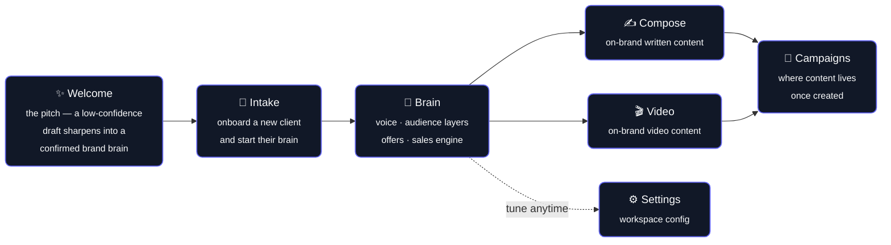

# 📣 Marketing Dept

**An AI marketing department for small businesses — built brand-first, not prompt-first.**

Instead of generating generic copy from a prompt, Marketing Dept builds a structured, evidence-backed **brand brain** for each client, and only ever writes from what that brain can actually prove.

<p>
  
  
  
  
  
</p>

---

## 💡 The idea

Most AI content tools skip straight to generation. Marketing Dept inserts a knowledge layer in between — encoded as **data**, not prose — so the model can't quietly make things up.

| Guardrail | What it means |
|---|---|
| 🔍 **Evidence grading** | Every claim about an audience carries a confidence level (`high` / `medium` / `low`) and a source. Generation refuses to lean on `low`-confidence claims. |
| 🚫 **Zero-new-belief offers** | Every offer names the belief a buyer must already hold for it to be purchasable — and links to evidence the audience actually holds it. No evidence, no offer. |
| 🔢 **Never invent numbers** | Every figure is either `confirmed` with a source, or flagged as unusable. Unconfirmed numbers never reach customer-facing output. |

That brain is **reusable**: once built, it drives on-brand copy and video generation for a client without re-deriving voice, audience, and offers every time.

---

## 🔄 How it works



| Step | Route | What happens |
|---|---|---|
| ✨ **Welcome** | `/welcome` | The pitch, told as a scroll-driven transformation from an inferred, low-confidence draft into a confirmed, evidence-backed brand brain. |
| 📝 **Intake** | `/intake` | Onboard a new tenant (business) and start building their brain. |
| 🧠 **Brain** | `/brain/[tenant]` | The structured profile: voice & brand rules, layered audiences (never blended in one piece of content), offers scored against the zero-new-belief test, and a sales engine (angles, funnel, posting rhythm). |
| ✍️ **Compose** | `/compose/[tenant]` | Generate on-brand written content from the tenant's brain. |
| 🎬 **Video** | `/video/[tenant]` | Generate on-brand video from the tenant's brain. |
| 📣 **Campaigns** | `/campaigns` | Where composed and video content lives once created. |
| ⚙️ **Settings** | `/settings` | Workspace configuration. |

---

## 🛠️ Tech stack

- **[Next.js 16](https://nextjs.org)** (App Router) + **React 19** + **TypeScript**
- **Tailwind CSS 4**
- **GSAP** + ScrollTrigger, **[Lenis](https://lenis.darkroom.engineering/)** for the scroll-driven welcome page
- Deployed on **Vercel**

---

## 🚀 Getting started

```bash
npm install
npm run dev
```

Open [http://localhost:3000](http://localhost:3000) 🎉

| Script | What it does |
|---|---|
| `npm run dev` | Start the dev server |
| `npm run build` | Production build |
| `npm run start` | Run the production build |
| `npm run lint` | Lint the codebase |

---

## 📁 Project structure

```
app/
  welcome/            marketing landing / pitch page
  (app)/
    page.tsx          dashboard
    intake/           new tenant onboarding
    brain/[tenant]/   brand brain viewer/editor
    compose/[tenant]/ content composition
    video/[tenant]/   video generation
    campaigns/        campaign/content library
    settings/         workspace settings
lib/
  types.ts            the brain schema — evidence, audience layers, offers, sales engine
  compose.ts          content composition logic
  video.ts            video generation logic
  tenants.ts          tenant/workspace data
```
